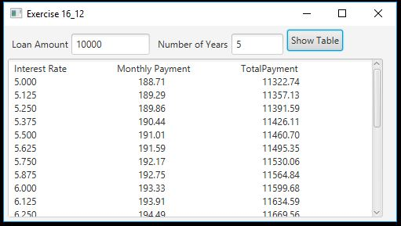

# 16.13 Compare loans with various interest rates

Rewrite Programming Exercise 5.21 to create a GUI, as shown in Figure 16.41b. Your program should let the user enter the loan
amount and loan period in the number of years from text fields, and it should display the monthly and total payments for each 
interest rate starting from 5% to 8%, with increments of one-eighth, in a text area.

## Example Output

## Analysis Steps

From looking at the figure that was given I realized I need an Hbox at the top of the GUI that would
have 2 text fields for loan amount and the life of the loan. I would also need a button which on click
would give the text field information to a function that would calculate the figures needed.

The function once completed would print to a text area that would hold the results. This function
would calculate the monthly payments and the life of the loan cost for multiple interest rates.

### Design
I used the standard classes required for a GUI plus I added in a function that would calculate the 
monthly payment and the lifetime loan amount. I made a for loop within the function to cycle through
all of the different interest rates and used the += to add to the text area without deleting the previous results.

### Testing

I also after playing with this code and not being able for the function to call in amounts and receive amounts
properly. I made a global text area so it communicate with both the GUI controls and the function to 
display the results properly. I made a for loop within the function to cycle through all of the different 
interest rates and used the += to add to the text area without deleting the previous results.

